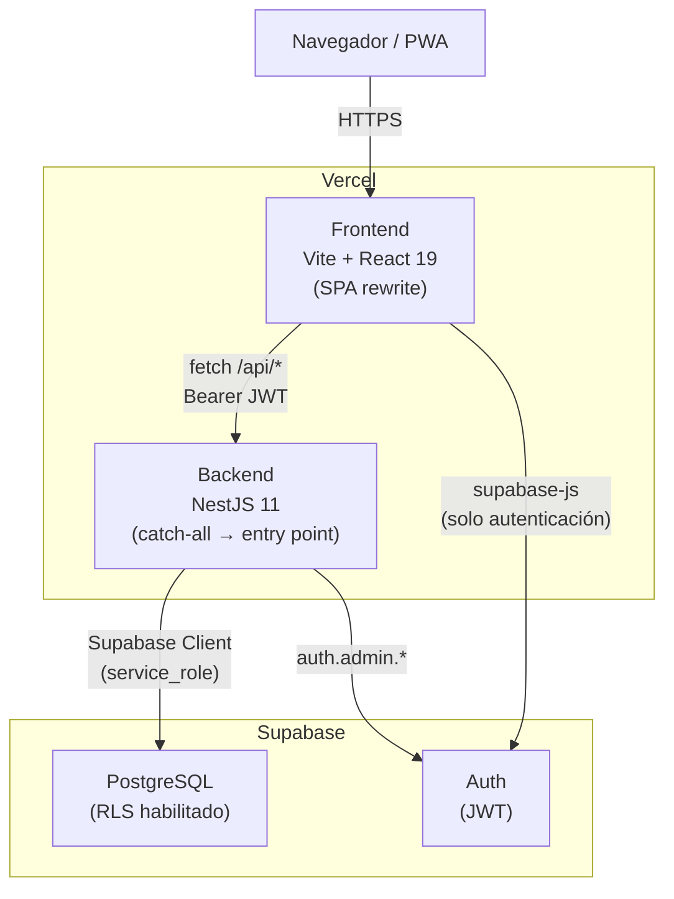
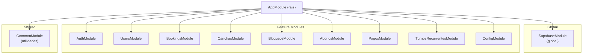
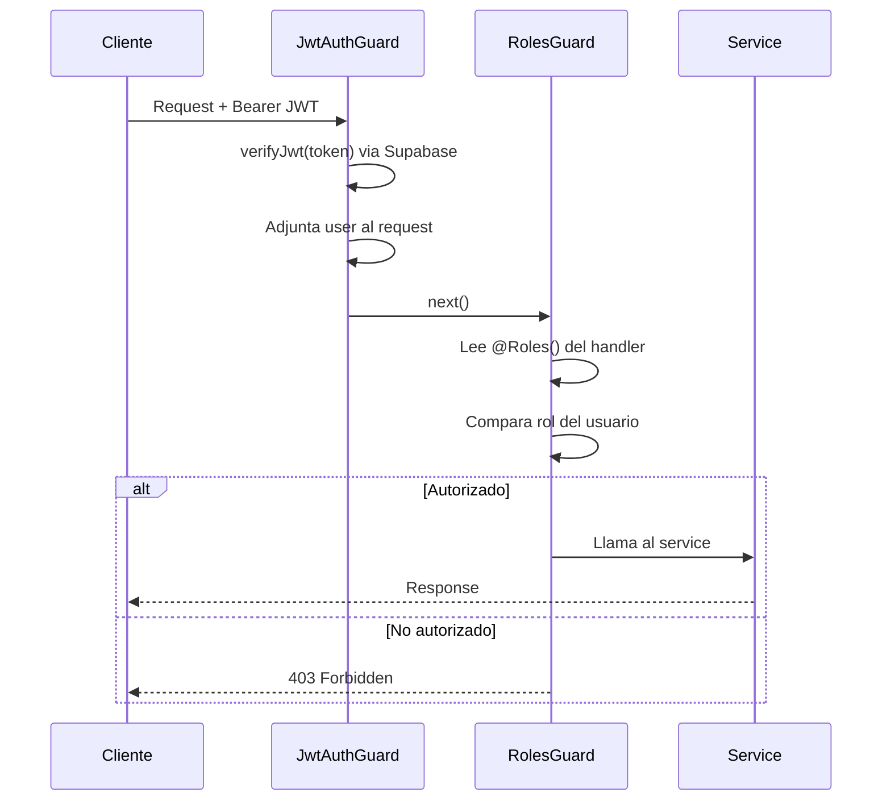
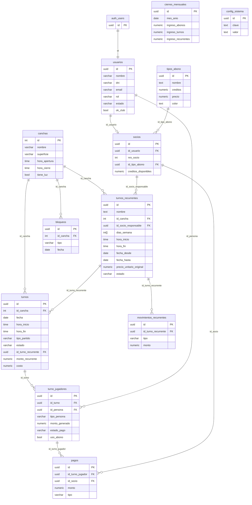
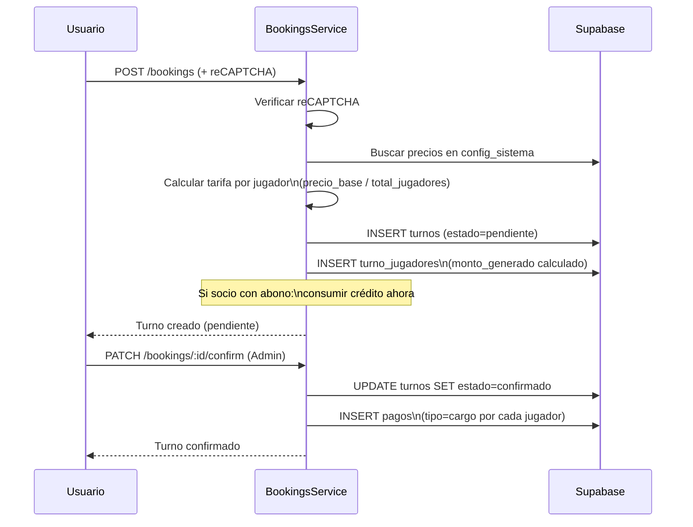

# Arquitectura — Sistema de Gestión de Canchas

Guía de referencia para desarrolladores. Tiempo estimado de lectura: 20 minutos.

---

## 1. Visión General

Sistema web de gestión de canchas de tenis para Club Belgrano (Buenos Aires).
Permite reservar canchas, administrar socios y abonos, gestionar turnos recurrentes y visualizar ingresos mensuales.

**Stack:** NestJS 11 (backend) + React 19 + Vite (frontend) + Supabase (Postgres + Auth) + Vercel (deploy)

**Monorepo** con NPM workspaces: `backend/` y `frontend/` comparten el mismo repositorio.

---

## 2. Diagrama de Arquitectura



**Flujo típico de request:**
1. El usuario inicia sesión → Supabase Auth devuelve JWT
2. El frontend guarda el JWT en `AuthContext` y lo inyecta en cada request via `lib/api.ts`
3. El backend valida el JWT con `JwtAuthGuard`, extrae el rol y aplica `RolesGuard`
4. El backend consulta Supabase con el cliente `service_role` (sin RLS) — la autorización la maneja NestJS

---

## 3. Backend — Módulos NestJS

### 3.1 Diagrama de módulos



### 3.2 Módulos y endpoints

| Módulo | Prefijo | Endpoints | Descripción |
|--------|---------|-----------|-------------|
| Auth | `/api/auth` | 4 | Login, registro, refresh, perfil |
| Users | `/api/users` | 12 | CRUD usuarios, búsqueda, historial |
| Bookings | `/api/bookings` | 8 | Reservas: crear, confirmar, cancelar |
| Canchas | `/api/canchas` | 4 | CRUD canchas |
| Bloqueos | `/api/bloqueos` | 4 | Bloquear franjas horarias |
| Abonos | `/api/abonos` | 8 | Tipos de abono, asignación, cierre mensual |
| Pagos | `/api/pagos` | 7 | Cobros, dashboard financiero |
| TurnosRecurrentes | `/api/turnos-recurrentes` | 10 | Reservas recurrentes, pagos, recálculo |
| Config | `/api/config` | 3 | Parámetros globales del sistema |
| Supabase | — | — | Cliente global (service_role) |
| Common | — | — | Guards, decoradores, utilidades |

### 3.3 Flujo de autenticación y autorización



**Roles disponibles:** `admin` · `socio` · `no-socio`

**Capa de seguridad adicional:**
- Google reCAPTCHA v3 en creación de turnos (endpoints públicos)
- Validación de DTOs con `class-validator` en todos los endpoints
- RLS en Supabase para `config_sistema` y `cierres_mensuales`

---

## 4. Modelo de Datos

### 4.1 Diagrama ER



### 4.2 Tablas principales

| Tabla | Descripción |
|-------|-------------|
| `usuarios` | Espejo de `auth.users`. Rol + estado del usuario en el sistema |
| `socios` | Detalle de membresía. Tiene abono y créditos fraccionarios |
| `tipos_abono` | Catálogo de abonos configurables (nombre, créditos, precio) |
| `canchas` | Canchas físicas con horarios propios |
| `turnos` | Reservas individuales. Lifecycle: pendiente → confirmado → cancelado |
| `turno_jugadores` | Un registro por jugador en cada turno |
| `pagos` | Libro mayor: cargos, pagos, bonificaciones, devoluciones |
| `bloqueos` | Franjas bloqueadas (torneos, clases, mantenimiento) |
| `turnos_recurrentes` | Grupos con reserva fija semanal. Tiene modelo de deuda propio |
| `movimientos_recurrentes` | Cobros asociados a recurrentes |
| `cierres_mensuales` | Snapshot financiero mensual (inmutable una vez creado) |
| `config_sistema` | Parámetros globales: precios, horarios, descuentos |

### 4.3 Decisiones de diseño notables

- **`socios.creditos_disponibles` como `NUMERIC(5,1)`**: los dobles consumen 0.5 créditos y los singles 1.0. Un `INTEGER` no alcanza.
- **`turnos.monto_recurrente` desnormalizado**: el precio por ocurrencia se guarda en cada turno para poder recalcular sin perder el histórico.
- **`cierres_mensuales` como snapshot**: los ingresos del mes se congelan al ejecutar el cierre. `ingreso_turnos` registra plata **cobrada** (tipo='pago'), no facturada (tipo='cargo').
- **Sin ORM**: queries directas al cliente Supabase (`supabaseService.getClient()`). Más verboso pero sin abstracción extra sobre Postgres.

---

## 5. Lógica de Negocio Crítica

### 5.1 Flujo de reserva (booking lifecycle)



### 5.2 Sistema de precios

Tres tarifas configurables en `config_sistema`:

| Tipo jugador | Clave config |
|---|---|
| No-socio | `precio_no_socio` |
| Socio sin abono | `precio_socio_sin_abono` |
| Socio con abono | `precio_socio_abonado` |

**Split de costo:** `tarifa_base / total_jugadores` = `monto_generado` por jugador.

**Lógica de abono:**
- Single: consume 1 crédito
- Doble: consume 0.5 créditos
- Si `creditos_disponibles < costo`, usa tarifa `precio_socio_sin_abono` como fallback

### 5.3 Turnos recurrentes — modelo de deuda

```
deuda        = SUM(monto_recurrente) de turnos pasados no cancelados
comprometido = SUM(monto_recurrente) de turnos futuros no cancelados
pagado       = SUM(monto) de movimientos_recurrentes donde tipo = 'pago'
saldo        = pagado − deuda   (positivo = a favor, negativo = debe)
```

---

## 6. Frontend — Estructura y Patrones

### 6.1 Rutas

| Tipo | Rutas | Acceso |
|------|-------|--------|
| Públicas | `/`, `/login`, `/register`, `/booking` | Cualquier visitante |
| Protegidas | `/dashboard`, `/mi-historial`, `/turnos-recurrentes` | Usuario autenticado |
| Admin | `/admin/*` | Solo rol `admin` |

### 6.2 Autenticación y API

- `AuthContext` provee `user`, `token`, `login()`, `logout()` a toda la app
- `lib/api.ts` es el cliente HTTP central: inyecta `Authorization: Bearer <token>` automáticamente en cada request
- `supabase-js` se usa **solo para autenticación**, no para queries a la DB

### 6.3 Design system

- CSS Variables pastel definidas en `frontend/src/index.css` (no Tailwind, no CSS-in-JS)
- Diseño mobile-first
- Componentes clave:
  - `Calendar` — grilla semanal de disponibilidad con slots coloreados por estado
  - `BookingForm` — formulario de reserva con typeahead de socios y preview de precio
  - `AdminLayout` — layout con sidebar para panel de administración
  - `DateInputDDMMYYYY` — input de fecha con formato local argentino
  - `usePagination` — hook reutilizado en todas las listas paginadas

### 6.4 Convenciones de fechas

```typescript
// Siempre usar TZ Argentina para evitar desfasajes de día
date.toLocaleDateString('en-CA', { timeZone: 'America/Argentina/Buenos_Aires' })
// Produce: "YYYY-MM-DD" en hora local
```

---

## 7. Deployment y DevOps

### 7.1 Vercel — configuración

| Servicio | Tipo | Configuración |
|----------|------|---------------|
| Frontend | SPA | `rewrites: [{ source: "/(.*)", destination: "/index.html" }]` |
| Backend | Serverless | `routes: [{ src: "/(.*)", dest: "/src/main.ts" }]` |

Ambos servicios viven en el mismo repositorio pero se despliegan como proyectos Vercel independientes.

### 7.2 Variables de entorno necesarias

**Backend (`backend/.env`):**
```
SUPABASE_URL=https://<project>.supabase.co
SUPABASE_SERVICE_ROLE_KEY=<service_role_key>
SUPABASE_JWT_SECRET=<jwt_secret>
RECAPTCHA_SECRET_KEY=<google_recaptcha_v3_secret>
```

**Frontend (`frontend/.env`):**
```
VITE_API_URL=https://<backend-url>/api
VITE_SUPABASE_URL=https://<project>.supabase.co
VITE_SUPABASE_ANON_KEY=<anon_key>
VITE_RECAPTCHA_SITE_KEY=<google_recaptcha_v3_site_key>
```

### 7.3 PWA

El frontend incluye un `manifest.json` que permite instalarlo como app nativa desde el navegador (sin pasar por App Store / Play Store). No tiene soporte offline (sin service worker).
